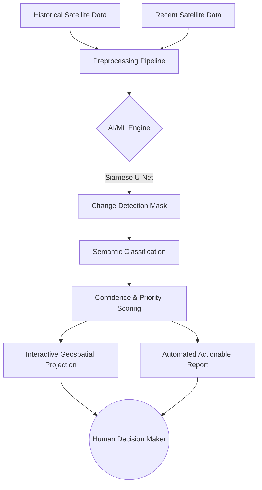

# 🌍 AI-Powered Earth Observation Analytics

  

An **AI-powered decision-support platform** that uses multi-temporal Earth Observation data to automatically identify meaningful geographic changes, prioritize them by significance, and help authorities focus human attention where it matters most.

**We are not building another satellite-image viewer. We are building an intelligence layer.**

---

## 🚀 The Core Philosophy

Today, monitoring massive geographical areas (forests, urban regions, disaster zones) is highly dependent on slow, manual human interpretation. 

Typical platforms stop at showing you the satellite imagery. We answer the crucial questions:
> **"What changed, where did it change, how significant is the change, and what locations should be investigated first?"**

Our pipeline translates raw pixels into **Actionable Geospatial Intelligence**:
`Detection ➔ Prioritization ➔ Explanation ➔ Action`

---

## 🧠 Supported Analytical Modules

We have built a unified Geospatial AI architecture that dynamically scales across three critical domains:

1. **🏗️ Infrastructure Change Detection**
   - **Dataset Architecture:** SpaceNet 7
   - **Use Case:** Automatically flagging significant urban development or illegal construction.
2. **🌪️ Disaster Management**
   - **Dataset Architecture:** xBD / xView2
   - **Use Case:** Rapid post-disaster impact screening to highlight highly damaged infrastructure for emergency responders.
3. **🌾 Agricultural Monitoring**
   - **Dataset Architecture:** AgriFieldNet / CropHarvest
   - **Use Case:** Detecting changes in crop patterns or identifying fallow land over seasonal observation periods.

---

## 🏗️ System Architecture

Our platform utilizes a robust Deep Learning backend connected to an interactive frontend. The core inference engine utilizes a custom **PyTorch Siamese U-Net** to compare temporal features and generate geographic segmentation masks.



---

## 💻 Running the Platform Locally

To run the full PyTorch inference engine and interactive dashboard on your local machine:

### 1. Install Dependencies
Ensure you have Python 3.9+ installed, then run:
```bash
pip install -r requirements.txt
```

### 2. Download the Dataset
We have included an automated script to download sample Earth Observation data from HuggingFace to test the model.
```bash
python src/download_data.py
```

### 3. Train the Siamese U-Net (Optional)
If you wish to retrain the weights on your own dataset:
```bash
python src/train.py --data_dir ./dataset --epochs 10
```

### 4. Launch the Dashboard
```bash
streamlit run src/app.py
```

---

## 🏆 Why this matters for the Hackathon
Our novelty does not lie simply in "using AI on satellite images." Our innovation is in **integrating Deep Learning, Temporal Analysis, and GIS into a seamless, decision-ready workflow.** 

Instead of overwhelming analysts with raw data, our system generates a prioritized "Intelligence Card" that calculates the exact affected area, provides an AI confidence score, and explicitly recommends field verification actions.
